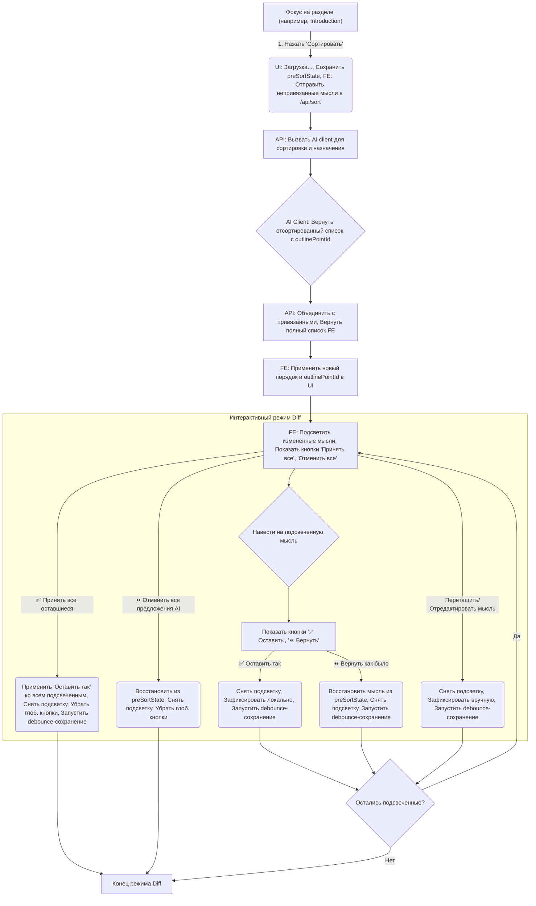

# Feature Design: AI Sort with Interactive Confirmation

## 1. Goal

Решить проблему "окончательности" и отсутствия контроля при использовании AI-сортировки мыслей в разделах проповеди (Introduction, Main Part, Conclusion). Предоставить пользователю механизм, аналогичный `git add/reset`, для просмотра, частичного или полного принятия/отклонения предложений AI перед их окончательным сохранением.

**Ключевые задачи:**

*   **Видимость:** Пользователь должен сразу видеть результат работы AI в контексте всего раздела.
*   **Контроль:** Пользователь должен иметь возможность принять или отклонить как отдельные предложения AI, так и все сразу.
*   **Гибкость:** Пользователь должен иметь возможность доработать результат AI с помощью ручного перетаскивания (drag-n-drop).
*   **Обратимость:** Должна быть простая возможность отменить *всю* последнюю операцию AI-сортировки.
*   **Надежность:** Изменения, явно подтвержденные пользователем, должны сохраняться автоматически, минимизируя риск потери работы.
*   **Итеративность:** Повторный запуск сортировки должен учитывать уже сделанные пользователем назначения и порядок.

## 2. Core Concept

Функция "Сортировать" в режиме фокуса для раздела проповеди будет работать по принципу "Интерактивного Diff":

1.  **Мгновенный Предпросмотр:** После нажатия "Сортировать" и ответа AI, UI немедленно обновляется, показывая новый порядок и предложенные назначения мыслей к пунктам плана.
2.  **Подсветка Изменений:** Мысли, затронутые AI (перемещенные или получившие назначение), визуально подсвечиваются.
3.  **Интерактивное Подтверждение/Отклонение:**
    *   **Локальное:** При наведении на подсвеченную мысль появляются кнопки для подтверждения (`✅ Оставить так`) или отмены (`⏪ Вернуть как было`) *конкретно этого* изменения AI.
    *   **Глобальное:** Появляются кнопки для подтверждения (`✅ Принять все оставшиеся`) или отмены (`⏪ Отменить все предложения AI`) *всех* изменений, сделанных последней операцией AI.
4.  **Ручная Доработка:** Пользователь может в любой момент начать перетаскивать или редактировать мысли. Любое ручное взаимодействие с мыслью автоматически "подтверждает" ее текущее состояние и снимает AI-подсветку.
5.  **Автосохранение:** Подтвержденные изменения (через кнопки "Оставить так", "Принять все" или ручное взаимодействие) автоматически сохраняются в базу данных с использованием дебаунсинга. Явной кнопки "Сохранить план" нет.

## 3. User Flow

**Детальное описание шагов:**

1.  **Запуск:** Пользователь находится в режиме фокуса на колонке (например, "Introduction") и нажимает кнопку "Сортировать".
2.  **Подготовка:**
    *   UI показывает индикатор загрузки.
    *   Frontend сохраняет текущее состояние мыслей и их порядок в этой колонке (`preSortState`).
    *   Frontend фильтрует мысли в колонке, отбирая только те, у которых нет `outlinePointId`.
    *   Ограниченный список (до 25) этих непривязанных мыслей отправляется на бэкенд (`POST /api/sort`) вместе с `sermonId`, `columnId` и списком `outlinePoints` для этой колонки.
3.  **Обработка на Бэкенде:**
    *   `/api/sort` получает данные, проверяет их.
    *   Вызывает AI Client (`sortItemsWithAI`), передавая непривязанные мысли, контекст проповеди и пункты плана.
    *   AI Client возвращает отсортированный список этих мыслей, где к некоторым может быть добавлен `outlinePointId` (на основе сопоставления с текстом `outlinePoints`).
    *   `/api/sort` объединяет отсортированные/назначенные мысли с теми, которые изначально были привязаны (и не отправлялись AI), сохраняя их исходные позиции относительно друг друга.
    *   `/api/sort` возвращает *полный* упорядоченный список мыслей для колонки.
4.  **Обновление UI:**
    *   Frontend получает ответ. Индикатор загрузки скрывается.
    *   UI немедленно обновляется, отображая *все* мысли в новом порядке.
    *   Мысли, которые были затронуты AI в последней операции, подсвечиваются:
        *   **Желтый фон/рамка + ✨:** Мысли, которым AI *предложил* `outlinePointId`.
        *   **Синий фон/рамка + ➡️:** Мысли, которые AI *переместил* (изменил порядок), но *не назначил* `outlinePointId`.
    *   Появляются глобальные кнопки "✅ Принять все оставшиеся предложения AI" и "⏪ Отменить все предложения AI".
5.  **Взаимодействие пользователя:**
    *   **Наведение:** При наведении на подсвеченную мысль появляются локальные кнопки "✅ Оставить так" и "⏪ Вернуть как было".
    *   **"✅ Оставить так":** Подсветка с этой мысли снимается. Ее текущее положение и `outlinePointId` (если был предложен) считаются подтвержденными. Запускается таймер дебаунсинга для сохранения этого изменения (`updateThought` и/или `updateStructure`).
    *   **"⏪ Вернуть как было":** Мысль возвращается на свое место и к своему состоянию (с/без `outlinePointId`) из `preSortState`. Подсветка снимается. Запускается таймер дебаунсинга для сохранения этого изменения.
    *   **Drag-n-Drop / Редактирование:** Если пользователь перетаскивает мысль или начинает ее редактировать, AI-подсветка с нее снимается. Новое состояние считается подтвержденным вручную. Запускается таймер дебаунсинга сохранения.
    *   **"✅ Принять все оставшиеся":** Действие "Оставить так" применяется ко всем *еще подсвеченным* мыслям. Глобальные кнопки исчезают. Режим Diff завершается. Запускается сохранение.
    *   **"⏪ Отменить все предложения AI":** UI полностью возвращается к `preSortState`. Глобальные кнопки исчезают. Подсветка снимается. Режим Diff завершается. Никаких сохранений не происходит (кроме отмены уже начатых debounce-сохранений).
6.  **Автосохранение:** Любое подтверждение (явное через кнопки или неявное через ручное редактирование) триггерит (через дебаунсинг) вызовы `updateThought` (для измененных `outlinePointId`) и `updateStructure` (для нового порядка).
7.  **Повторный Запуск:** Если пользователь снова нажимает "Сортировать", процесс повторяется с шага 2, используя *текущее* состояние мыслей (включая уже подтвержденные назначения).

## 4. UI Elements

*   **Кнопка "Сортировать":** Стандартная кнопка в заголовке колонки (в режиме фокуса).
*   **Индикатор Загрузки:** Показывается во время работы AI.
*   **Подсветка Мыслей:**
    *   Стиль 1 (e.g., желтый): Для мыслей с предложенным `outlinePointId`.
    *   Стиль 2 (e.g., синий): Для мыслей, которые были перемещены, но не назначены.
*   **Иконки Подсветки:** ✨ (назначено), ➡️ (перемещено).
*   **Кнопки при Наведении:**
    *   `✅ Оставить так` (маленькая, зеленая).
    *   `⏪ Вернуть как было` (маленькая, оранжевая/серая).
*   **Глобальные Кнопки (после сортировки):**
    *   `✅ Принять все оставшиеся предложения AI` (заметная, зеленая).
    *   `⏪ Отменить все предложения AI` (заметная, красная/серая).

## 5. Key Benefits

*   **Контроль:** Полный контроль над предложениями AI на глобальном и локальном уровнях.
*   **Наглядность:** Мгновенная визуализация результата в контексте.
*   **Гибкость:** Легкий переход к ручной доработке с помощью drag-n-drop.
*   **Безопасность:** Простая отмена всей операции AI и автоматическое сохранение подтвержденных изменений.
*   **Интеграция:** Использует существующие UI-паттерны (drag-n-drop, автосохранение).

## 6. Potential Risks/Challenges

*   **Сложность State Management:** Управление `preSortState`, текущим состоянием, подсвеченными элементами и очередью на сохранение требует аккуратности.
*   **Производительность UI:** Перерисовка списка с подсветкой и кнопками при наведении должна быть оптимизирована.
*   **Логика Сохранения:** Дебаунсинг должен быть настроен так, чтобы не перегружать бэкенд, но и сохранять изменения достаточно часто. Нужно обрабатывать конфликты, если пользователь быстро делает несколько действий.
*   **Четкость Подсветки:** Визуальное различие между типами подсветки и ее ненавязчивость.

---

# Implementation Plan: AI Sort with Interactive Confirmation

## 1. Prerequisites

*   Убедиться, что используется стабильная библиотека для state management (например, Zustand или Redux Toolkit, если проект уже их использует, или стандартный React `useState`/`useReducer` при хорошей организации).
*   Наличие UI-компонентов для кнопок, иконок, индикаторов загрузки.
*   Настроенный `debouncing` (например, с помощью `lodash/debounce`).
*   Настроенная система уведомлений (`sonner`).

## 2. Task Breakdown

### Frontend (`StructurePageContent`, `Column`, `SortableItem`)

1.  **State Management (`StructurePageContent`):**
    *   Добавить состояние `preSortState: Record<string, Item[]> | null` для хранения состояния колонки *до* сортировки.
    *   Добавить состояние `highlightedItems: Record<string, { type: 'assigned' | 'moved' }> | null` для отслеживания подсвеченных мыслей и типа изменения. Ключ - `itemId`.
    *   Добавить состояние `isDiffModeActive: boolean` для управления видимостью глобальных кнопок и подсветки.
    *   Добавить состояние `isSaving: boolean` для индикации процесса сохранения (если дебаунсинг требует явного индикатора).

2.  **Triggering Sort (`Column` -> `StructurePageContent` -> `handleAiSort`):**
    *   В `handleAiSort`:
        *   Перед отправкой запроса, сохранить текущее состояние *всех* мыслей в `preSortState`.
        *   Установить `isDiffModeActive = true`.
        *   Отфильтровать *только* непривязанные мысли (`!item.outlinePointId`).
        *   Ограничить список до `MAX_THOUGHTS_FOR_SORTING`.
        *   Отправить запрос в `sortAI.service`.

3.  **Processing Response (`handleAiSort`):**
    *   При получении `sortedItems` от `/api/sort`:
        *   Создать новый `containers` state, заменяя *все* элементы в `columnId` на `sortedItems`.
        *   Сравнить `sortedItems` с `preSortState[columnId]`, чтобы определить `highlightedItems`:
            *   Если `outlinePointId` появился/изменился -> `type: 'assigned'`.
            *   Если `outlinePointId` не изменился (или его нет), но позиция изменилась -> `type: 'moved'`.
        *   Установить `highlightedItems`.
        *   Сбросить `isSorting = false`.

4.  **UI Rendering (`Column`, `SortableItem`):**
    *   В `Column`:
        *   Условно рендерить глобальные кнопки "Принять все", "Отменить все" если `isDiffModeActive`.
    *   В `SortableItem`:
        *   Применить стили подсветки (желтый/синий) на основе `highlightedItems[item.id]?.type`.
        *   Условно рендерить кнопки "✅ Оставить так", "⏪ Вернуть как было" при наведении, если `highlightedItems[item.id]` существует.

5.  **Event Handlers (`StructurePageContent`):**
    *   `handleKeepItem(itemId)`:
        *   Удалить `itemId` из `highlightedItems`.
        *   Найти `item` в текущем `containers[columnId]`.
        *   Запустить debounce-сохранение для этого `item` (`updateThought` если `outlinePointId` есть) и для всей структуры (`updateStructure`).
        *   Если `highlightedItems` стал пустым, установить `isDiffModeActive = false`.
    *   `handleRevertItem(itemId)`:
        *   Удалить `itemId` из `highlightedItems`.
        *   Найти `item` в `preSortState[columnId]`.
        *   Найти *текущую* позицию `item` с `itemId` в `containers[columnId]`.
        *   Обновить `containers`, возвращая `item` к состоянию из `preSortState` и помещая его на *исходную позицию* (может потребовать сдвига других элементов).
        *   Запустить debounce-сохранение.
        *   Если `highlightedItems` стал пустым, установить `isDiffModeActive = false`.
    *   `handleKeepAll()`:
        *   Создать список всех `itemId` из `highlightedItems`.
        *   Установить `highlightedItems = null`, `isDiffModeActive = false`.
        *   Для каждого `itemId` запустить debounce-сохранение (`updateThought` и `updateStructure`).
    *   `handleRevertAll()`:
        *   Восстановить `containers` из `preSortState`.
        *   Установить `highlightedItems = null`, `isDiffModeActive = false`.
        *   Отменить все ожидающие debounce-сохранения.
    *   Обновить обработчики `onDragEnd` и `onEdit`:
        *   В начале обработчика, если `highlightedItems[activeItemId]` существует, удалить его из `highlightedItems`.
        *   Запустить debounce-сохранение после завершения drag-n-drop или редактирования.
        *   Если `highlightedItems` стал пустым, установить `isDiffModeActive = false`.

6.  **Saving Logic (`StructurePageContent`):**
    *   Создать `debouncedSaveStructure(structureData)`: вызывает `updateStructure`.
    *   Создать `debouncedSaveThought(thoughtData)`: вызывает `updateThought`.
    *   В обработчиках (`handleKeepItem`, `handleRevertItem`, `handleKeepAll`, `onDragEnd`, `onEdit`) вызывать соответствующие debounce-функции с актуальными данными. Учесть, что `updateStructure` нужно вызывать с *полным* объектом структуры для всех секций.

7.  **Loading/Error States:**
    *   Использовать `isSorting` для показа индикатора загрузки кнопки "Сортировать".
    *   Использовать `isSaving` (если нужно) для индикации фонового сохранения.
    *   Использовать `toast.error` при ошибках API.

### Backend

1.  **API Route (`/api/sort/route.ts`):**
    *   **Убедиться**, что он принимает `outlinePoints` в запросе.
    *   **Убедиться**, что он фильтрует *только непривязанные* `items` перед передачей в AI Client.
    *   **Убедиться**, что он *объединяет* результат `sortItemsWithAI` с *привязанными* мыслями, которые не отправлялись AI, перед отправкой ответа клиенту.

2.  **AI Client (`/api/clients/openAI.client.ts` -> `sortItemsWithAI`):**
    *   Перепроверить и, возможно, усилить prompt (`sortingTemplate.ts`) для *строгого* следования `outlinePoints` при назначении `outlinePoint` в ответе.
    *   Убедиться, что логика сопоставления текста `outlinePoint` из ответа AI с ID реального `OutlinePoint` работает надежно (точное совпадение, подстрока, fuzzy matching).
    *   Убедиться, что функция возвращает *все* исходно переданные ей элементы, даже если AI их пропустил (добавляя их в конец).

3.  **API Route (`/api/thoughts/route.ts` -> PUT):**
    *   Убедиться, что PUT-запрос корректно обновляет `outlinePointId` для конкретной мысли в массиве `thoughts` документа `Sermon`. Использовать транзакцию для надежности.

4.  **API Route (`/api/structure/route.ts` -> PUT):**
    *   Убедиться, что PUT-запрос корректно и полностью перезаписывает поле `structure` в документе `Sermon`.

### Database

*   Скорее всего, изменения в схеме `Sermon` не требуются, так как поля `structure` и `outlinePointId` в `Thought` уже существуют.

## 3. Testing Strategy

*   **Unit Tests:**
    *   Тестировать логику `handleAiSort` (фильтрация, вызов сервиса).
    *   Тестировать логику обработчиков `handleKeepItem`, `handleRevertItem`, `handleKeepAll`, `handleRevertAll` (изменение state, вызовы debounce).
    *   Тестировать логику обновления UI (`SortableItem`) на основе `highlightedItems`.
    *   Тестировать логику парсинга и сопоставления `outlinePoint` в `openAI.client`.
    *   Тестировать обработчики API-маршрутов (`/api/sort`, `/api/thoughts`, `/api/structure`) с моками зависимостей (AI, DB).
*   **Integration Tests:**
    *   Тестировать полный цикл: Нажатие "Сортировать" -> Загрузка -> Обновление UI -> Нажатие "✅ Оставить так" -> Вызов debounce-сохранения -> Проверка вызова `updateThought`/`updateStructure`.
    *   Тестировать полный цикл с отменой (`⏪ Вернуть как было`, `⏪ Отменить все`).
    *   Тестировать взаимодействие ручного drag-n-drop с режимом Diff.
*   **UI/E2E Tests:**
    *   Визуально проверить корректность подсветки и появления/исчезновения кнопок.
    *   Проверить отзывчивость UI при большом количестве мыслей.

## 4. Rollout Strategy (Optional)

*   Можно внедрить за feature flag, чтобы тестировать на ограниченной группе пользователей.
*   Начать с MVP (базовая подсветка, глобальные кнопки), затем добавить локальные кнопки и интеграцию с drag-n-drop.

## 5. Estimated Effort (High-level)

*   **Large (L):** Требует значительных изменений в state management фронтенда, UI-логике и координации нескольких API-вызовов с автосохранением.