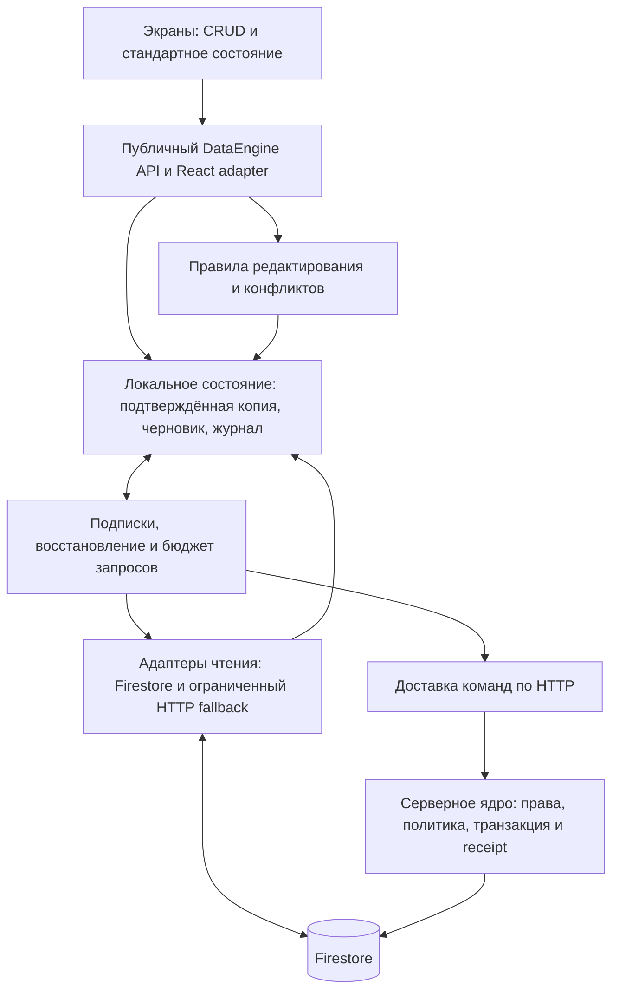

# DataEngine — предложение архитектуры для сверки

2026-09-12 · Mike THINK · статус: предложение, не принято и не реализовано.

Основа: [аудит CONTEXT](../audits/2026-09-12-sync-mechanisms-context.md), текущий снимок `1aa2f34c`, [старое исследование](../../FIRESTORE_SYNC_RESEARCH.md). Исторический документ содержит полезные варианты и опровержения, но прямо помечен NOT implemented; его старые ссылки и оценки не считаются текущими измерениями.

## 1. Совпадение с видением владельца

Да: все экраны обращаются к одному публичному интерфейсу. Он владеет чтением, созданием, изменением, удалением, локальным хранением, отправкой, получением чужих изменений, восстановлением, конфликтами и состоянием для стандартной плашки. Экран больше не соединяет самостоятельно Firestore, query-cache, baseline, outbox и durable draft.

Два обязательных уточнения:

- `read` — наблюдаемое состояние, а не только одноразовый Promise. Модуль возвращает копию и обновляет подписанного потребителя при изменении данных или их статуса.
- «Свежие данные» означают последнюю подтверждённую копию с известным происхождением и временем проверки. При отсутствии связи/выгрузке процесса знание о новых событиях невозможно; модуль сообщает об этом, сохраняет работу и догоняет сервер при возобновлении.

Единая точка входа не обязана быть одним файлом, единственным физическим кэшем или одинаковой политикой конфликта для всех типов данных. Это одна граница ответственности, внутри которой находятся проверяемые части.

## 2. Корень и идеальный результат

Карта нынешней системы: экран держит набираемый текст; React Query держит видимую копию; Firestore держит реплику; локальные draft/outbox держат часть намерений; сервисы и mutationDefaults по-разному отправляют их. Единого владельца связи между подтверждённой основой, новым текстом и результатом конкретной операции нет.

Причинная цепочка по аудиту:

1. Независимые правки теряются: вызывающий код или merge отправляет старое соседнее значение вместо собственного изменения.
2. Вход допускает это: baseline необязателен, целые массивы и обходные записи разрешены.
3. После отказа результатом распоряжается экран: он может убрать текст, хотя транспорт корректно отказал.
4. После reload операция попадает в другую функцию: контракт может стать слабее.
5. Detector следит за текстовыми вызовами SDK, а не за всеми этими условиями.

Это два связанных класса: раздробленное владение протоколом и дефекты самих алгоритмов слияния. Инкапсуляция устраняет необходимость собирать протокол на каждом экране; общие поведенческие проверки должны ловить ошибки внутри разрешённого ядра. Перенос плохого merge в единственный файл не делает его правильным.

Идеальный результат: агент, добавляя новый редактор, описывает только данные и действие пользователя. Получает те же гарантии, что все остальные; неправильно подключённый код не проходит проверку. Пользователь продолжает работать со своим текстом при проблемах связи, видит правдивое состояние и не теряет отклонённые изменения.

### Проверка противоречий

| Противоречие | Разделение / существующий ресурс | Честный итог |
|---|---|---|
| Автоматически показывать новый серверный текст и сохранять ещё не отправленный ввод | По состоянию: confirmed, draft и remote candidate; в существующем редакторе заметок уже есть части такого разделения | Совместимо: чистый вид обновляется, dirty-редактор сохраняет свою сессию; общая плашка объясняет ситуацию |
| Немедленный ввод и доказанное локальное сохранение | Во времени: показать букву сейчас, подтвердить сохранность после commit; local draft отделён от сетевого debounce | Совместимо с честным статусом; авария до commit всё ещё может потерять последние неподтверждённые символы |
| Один интерфейс и разные действия текста, календаря, связей | По уровню: общий жизненный цикл, зарегистрированные доменные операции/политики внутри | Совместимо; универсальная замена JSON без знания операции недостаточна |
| Всегда актуальны все данные на всех устройствах и конечная бесплатная квота | По области: активный набор наблюдения; по времени: deferred sync при потолке | Полностью не разрешено: это ограничение нагрузки/свежести. Подмена этого условия словом PWA была бы неверным обещанием |

Причинные механизмы конкретных пяти отказов воспроизведены в CONTEXT. Устранение всего класса новой архитектурой пока не проверено включением/выключением реализации: её ещё нет. Здесь сформулированы опровержимые условия, а не объявлена доказанная идеальность.

## 3. Варианты и цена

Оси сравнения: владение редактированием, место исполнения записи, формат намерения, доставка изменений, физическая схема данных, повтор/идентичность, расход, стоимость миграции. Все рассматриваются до выбора. Поиск ограничен одним независимым кругом альтернатив и одним кругом проверки предложения; это выбор обоснованного направления, не доказательство глобальной оптимальности.

| Вариант | Что получаем | Что платим / контрпример |
|---|---|---|
| A0. Только обёртка CRUD над нынешними сервисами | Мало изменений и понятный импорт | Если остаются прежние очереди, разные baselines и экранное восстановление, это новая вывеска над прежним протоколом. Пять сценариев аудита от обёртки не исчезнут. |
| A. Полноценный клиентский движок над Firebase SDK | Та же единая сессия редактирования, durable intents, исходные значения и tombstones; транзакционный повтор исполняется клиентом. Меньше новой серверной инфраструктуры, переиспользуем существующий guarded writer | Сложность правильного replay остаётся на клиенте; серверные writers всё равно требуют общего контракта. При молчащем SDK запись не продвигается. HTTP fallback записи безопасен только с тем же общим протоколом/receipt, что приближает этот вариант к B. Жёсткий бюджет listeners не обеспечивается. |
| B. Единый движок с локальным журналом, команды через сервер, чтение через адаптеры | Один протокол применения и восстановления; повторяемый HTTP-запрос может безопасно получить прежний результат; переиспользуем Firebase и существующие доменные функции | Мы отвечаем за журнал, версии протокола, восстановление, серверные receipts, миграцию старых writers и стоимость служебных операций. Это существенная работа, а не тонкий wrapper. |
| C. Готовая локальная БД и механизм репликации | Часть очередей, checkpoints, multi-tab и конфликтов уже реализована библиотекой | Нужно доказать Firestore-совместимость, условия хранения/лицензии, нашу политику конфликтов, серверные writers, междокументные действия и миграцию. Нельзя ставить вторую независимую репликацию поверх нынешних очередей. |
| D. CRDT для всех документов | Автоматическая сходимость многих параллельных правок | Новый формат/история, интеграция редакторов, хранение и доставка. Сходимость не определяет бизнес-смысл удаления, прав и переноса между сериями. Для конкурентного текста полезен отдельный адаптер, универсальность пока не обоснована. |
| E. Всё через сервер с общим допуском по бюджету | Централизованный протокол и возможность ограничить контролируемый приложением расход | Нужны также серверная доставка изменений, собственный read-cache/delta механизм и учёт бюджета вне платных операций Firestore. Прямые SDK reads уже не могут оставаться обходным каналом. Цена выше B. |
| F. Блокировка документа за одним устройством | Проще конкуренция при устойчивой связи | Офлайн-устройство не знает о новом владельце блокировки; сервер всё равно должен отвергать старые записи, а его текст надо сохранять. Блокировка не заменяет журнал и конфликтный контракт. |

Предварительный выбор: **B как целевая граница ответственности** с учётом уже наблюдавшегося молчащего SDK на iPad и действующих HTTP-путей service orders/councils. Независимый поиск (gpt-5.6-sol, чистый контекст) поставил A первым по цене и миграции; это серьёзный конкурент, а не пустая обёртка. Окончательная проверка A против B — способен ли A продолжать подтверждённые записи, когда SDK не отвечает, а HTTP работает, без второго расходящегося протокола.

C остаётся кандидатом на внутреннюю реализацию локального хранения/репликации после узкого сравнительного эксперимента. D полезен, если появится требование совместного редактирования одного текста в реальном времени. E — отдельная ветвь, если жёсткий потолок расходов важнее непрерывной сетевой актуальности.

Это не решение «всё написать самим». Прежде чем выбирать собственную реализацию каждого внутреннего механизма, сравниваем готовую с тем же контрактом и теми же сценариями отказа.

### Ход 37 — одинаковый интерфейс, разные механизмы слияния

Независимый кандидат: структурные данные обрабатываются обычными командами/CAS, а CRDT подключается только для текста, которому действительно нужно одновременное редактирование. Это не согласованное расширение.

| Поле | Содержание |
|---|---|
| Что отдаёт | Автоматическое совмещение символьных правок в выбранных текстовых ресурсах без миграции календаря/настроек/связей в CRDT |
| Что берёт | Второй внутренний адаптер, его историю, import/export и правила согласования текста с metadata и удалением |
| Когда станет видно | На первом пилоте одной заметки, одновременно редактируемой двумя устройствами |
| Чем опровергается | Итоговый текст неприемлем человеку либо смешанный протокол даёт больше проблем и цены, чем сохранение двух версий с выбором |
| Самый дешёвый тест | Та же матрица двух клиентов для одной заметки с CRDT и без него; проверить не только сходимость, но и читаемость результата |

Предлагаю оставить этот вариант внутри границы расширяемости, а не делать обязательной первой реализацией: требование посимвольной совместной работы пока не заявлено. Смена направления на такой пилот требует отдельной сверки владельца.

## 4. Предлагаемая граница модуля

Рабочее имя: `DataEngine`. Внутренние названия описывают обязанности, не фиксируют обязательное число файлов.



Один логический пакет имеет клиентскую и серверную части. Только адаптеры внутри границы имеют право обращаться к Firebase/IDB/CRUD endpoints. Серверные API, AI-результаты, фоновые задачи и административные операции тоже проходят серверное ядро. Оно проверяет права самостоятельно: Admin SDK не подчиняется клиентским Firestore Rules.

React Query может остаться адаптером представления и кэширования. Для мигрированного домена он перестаёт быть независимым владельцем очереди и подтверждённой основы. Нельзя удалить его нынешний persister до проверки эквивалентного холодного офлайн-старта через новый механизм.

Транспорт Firestore сохраняет свою реплику. Мы не пишем в приватную IndexedDB SDK и не объявляем, что у всех транспортов физически один кэш. У движка одна логическая модель и правила принятия любой копии.

### Публичный интерфейс

CRUD остаётся языком потребителя, но `update` получает конкретное изменение в управляемой сессии, а не произвольную старую копию документа. Ни UI, ни агент, создающий UI, не вычисляет номер версии, retry, outbox route или подтверждение сохранения вручную.

Иллюстрация, не реализованный API:

```ts
const note = useDataDocument(resources.studyNote(noteId));

note.read();
note.update({ title: nextTitle });
note.delete();
data.create(resources.studyNotes, initialValues);

// The adapter owns the editing session and exposes standard status.
<SyncStatus state={note.syncState} />
```

Под `useDataDocument` лежит headless session handle: он связывает конкретный читаемый снимок, правки и подтверждения. `update` для текстового редактора сохраняет локальный draft, а момент отправки определяется общим профилем autosave/blur/manual. Разные UX сохранения сохраняются как декларативная конфигурация, а не новые реализации протокола.

Для набросков/встреч допускаются типизированные действия `addItem`, `updateItem`, `removeItem`, `moveItem`; перенос между сериями — зарегистрированная атомарная доменная команда. Они проходят ту же границу и журнал. Попытка выразить перенос двумя отдельными CRUD-записями не сохраняет его атомарность.

## 5. Три копии внутри, один понятный результат снаружи

Движок обязан различать:

1. **Confirmed** — содержимое и версия из одного принятого серверного результата.
2. **Draft / pending intent** — то, что человек изменил, включая более новую правку, набранную пока шла предыдущая запись.
3. **Remote candidate** — новая чужая копия, ещё не принятая в редактируемый текст.

Состояние состоит из независимых измерений: локальная сохранность (`writing-local / durable / storage-failed`), доставка (`queued / sending / unknown / acknowledged / refused`), свежесть (`cached / checking / observed-current / unavailable`), наличие конфликта/удаления. Один флаг `isSynced` не выражает допустимые сочетания, например «серверная копия получена, поверх неё ещё не отправленный текст».

У снимка есть owner, поколение документа/версия, полнота (detail vs projection), источник и время последнего доказательства. Усечённая карточка списка не заменяет полный документ. Нельзя сравнивать только локальные часы `updatedAt` и считать больший timestamp доказательством причинного порядка.

### Сценарий чтения и чужого изменения

- iPad открывает запись: получает локальную копию сразу, если она есть; состояние говорит, проверена ли она сервером. Нет локальной записи — это `not-cached`, а не «документ удалён».
- Движок подписывается на нужный документ/ограниченный запрос. Несколько компонентов разделяют один ресурс подписки внутри экземпляра движка.
- При чистом редакторе новая подтверждённая копия автоматически отображается. При набираемом тексте она сохраняется отдельно; общая плашка предлагает принять/сопоставить её, не стирая ввод и не перемещая курсор неожиданно.
- Разные поля/элементы можно объединять по объявленной политике. Текст, который человек сейчас редактирует, защищён от автоматической подмены.
- Чужое удаление чистой записи убирает её из списка и переводит открытый экран в состояние «удалено». При локальном тексте сохраняется восстановительный черновик с действиями «создать новую запись / скопировать / отменить свою правку»; старый документ не воскрешается.
- Исчезновение из ограниченного списка не доказывает удаление: запись могла выйти за limit или перестать подходить под фильтр. Для удаления нужен tombstone/авторитетный ответ по конкретному документу.

Неактивные домены не требуется постоянно читать в фоне. Их cached-копии могут быть старыми; при следующем чтении движок запускает проверку. На открытом экране изменения приходят автоматически при рабочем канале; после сна/возврата сети механизм догоняет сервер. Старый снимок никогда не даёт права безусловно перезаписать новый.

**Режим при молчащем SDK — обязательная часть ядра.** Менеджер чтений различает рабочий listener, деградировавший канал и отсутствие связи. Для открытого документа в деградировавшем режиме он выполняет периодическую авторизованную HTTP-проверку конкретного документа, включая подтверждённое удаление. Проверка списка один раз этого не заменяет. Интервал и лимит запросов задаются общей политикой; ответы защищены owner/session/subscription generation и версиями, dirty-текст остаётся отдельно. При исчерпании бюджета/ошибке состояние становится cached/unverified, а не сохраняет ложный статус актуальности.

Возврат на SDK допускается после доказанного восстановления; два источника не должны запускать независимые циклы принятия текста. Разделяем измерения: время доставки при рабочем listener, максимальный возраст проверки в HTTP-режиме и время догоняющей проверки после resume. Для каждого нужен свой тест; универсальное обещание «всегда ≤5 секунд» не даётся.

## 6. Запись и восстановление

### Локальная часть

Буквы могут появляться сразу, до завершения IndexedDB-транзакции. Но «сохранено на устройстве» выдаётся только после успешного завершения локальной записи. До этого состояние `writing-local`; закрытие/ошибка хранения не маскируется зелёным подтверждением.

Черновик записывается локально независимо от сетевого debounce. При отправке неизменяемая команда и её связь с конкретным поколением черновика фиксируются атомарно в локальном журнале. Перезапуск до отправки восстанавливает draft; после постановки восстанавливает ту же команду. Подтверждение старой команды снимает только принадлежащую ей часть состояния, а не весь новый текст.

Команда несёт устойчивый `operationId`, owner, тип/версию протокола, resource ID и поколение ресурса, прочитанную основу нужных полей, конкретное изменение и зависимости. В рабочей памяти отдельно есть auth/session generation для отсечения поздних ответов. Новый вход того же владельца не должен навсегда блокировать старый журнал из-за прежнего session generation.

ID команды и её payload неизменяемы после первой возможной отправки. Autosave объединяет ещё не отправленный текст до создания сетевой команды; нельзя задним числом переписать payload уже отправленного ID. Команды с неизвестным результатом не становятся новыми командами автоматически.

### Серверная часть

Сервер проверяет идентичность пользователя и право на ресурс, совместимость схемы, допустимый формат `operationId` и существующий receipt при его наличии, исходную основу и доменную политику. В одной Firestore-транзакции применяет допустимое изменение и сохраняет receipt с ID/хешем команды/результатом. Повтор с тем же ID и другим payload отвергается.

Это **повторяемая доставка с идемпотентным эффектом**, а не обещание «сеть доставляет ровно один раз». Потерялся HTTP-ответ — клиент запрашивает результат или повторяет ту же неизменяемую команду по тому же протоколу. Предыдущие HTTP-пути без такого receipt по-прежнему нельзя автоматически переотправлять при timeout.

В receipt должны быть достаточные данные для согласования именно принятой операции с локальным поколением. Можно получить подтверждённый результат HTTP раньше SDK snapshot; ждать молчащего SDK для признания известного commit не требуется. Более старый последующий snapshot не понижает принятую версию.

Команды одного ресурса упорядочиваются; независимые ресурсы продолжают работу при конфликте одного. Несколько вкладок координируют отправку через lease/owner election, но это оптимизация: правильность повтора обеспечивается сервером даже при временных двух отправителях.

Порядок — обязательный **серверный** контракт, не только FIFO одной вкладки. Зависимая команда содержит ID предшественников, поколение ресурса и исходные значения затронутых полей/элементов. Сервер проверяет завершённость предшественников и допустимость основы; опоздавший зависимый update не может обойти unknown/conflicted predecessor. Независимые команды с разных устройств не обязаны иметь искусственный общий клиентский порядок: их совместимость проверяется транзакционно. Изменение основы/зависимостей после разрешения конфликта создаёт новую команду, сохраняя связь с прежней.

`permission-denied`, удаление, несовместимая схема, конфликт и квота — разные исходы. Конфликт не повторяется бесконечно. Временная сеть повторяется с backoff; неопределённый результат проверяется с тем же ID. Недоступный сервер не означает разрешение обойти ядро прямой SDK-записью.

### Создание, удаление, срок жизни протокола

- Create получает устойчивый resource ID до сети. Повтор create не является `setDoc` поверх любого уже существующего документа.
- Delete — серверно проверяемая операция с исходной основой. На сервере остаётся tombstone/поколение удаления, позволяющее отвергнуть поздний update/create старой жизни документа. В чистом UI удаление может отображаться оптимистично со статусом pending.
- Edit после чужого delete не восстанавливает старый ID автоматически. Намеренное восстановление — явное новое действие, по умолчанию новая запись.
- Если create точно никогда не отправлялся, последующий локальный delete может отменить его. После состояния sending/unknown такое сокращение без проверки результата недопустимо.
- Receipt/tombstone нельзя просто удалять по произвольному короткому TTL и обещать безопасность бесконечно офлайн-устройству. Нужен минимальный поддерживаемый epoch/checkpoint: слишком старый журнал сначала восстанавливается/сопоставляется, а не исполняется как новый. Число дней хранения — открытый параметр до PLAN.
- Внешние эффекты (отправка письма, AI-вызов, объектный storage) не входят в атомарность Firestore-транзакции. При их включении нужны отдельные протоколы, а не обещание атомарного CRUD на всю инфраструктуру.

Минимальный протокол migrated resource: receipt address = `{owner, operationId}`; одинаковый ID требует одинакового command hash; существующий receipt возвращает прежний результат; неизвестная слишком старая команда не исполняется; новая допустимая команда проверяет зависимости и resource generation; её эффект и receipt фиксируются атомарно. Все зарегистрированные create/update/delete обязаны пройти эту проверку. Пропуск receipt или обход tombstone — ошибка contract suite, а не разрешённая особенность отдельного сервиса.

## 7. Политики конфликтов и форма данных

| Действие | Политика по умолчанию для обсуждения |
|---|---|
| Разные поля / разные существующие элементы | Сохранить оба изменения; сравнивать только затронутые поля с их принятой основой |
| Одинаковое поле стало одинаковым значением | Совместимый результат; не создавать ложный конфликт |
| Один текст изменён по-разному | Сохранить оба варианта и общую основу; предложить выбор/слияние. Автоматическое переписывание человеческого смысла не требуется от общего ядра |
| Два независимых добавления | Сохранить оба устойчивых ID без дублей при повторе |
| Delete против edit | Сохранить удалённость ресурса и восстановительный текст; не терять текст и не воскрешать молча |
| Перестановка | Смысловая операция по ID/соседу с объявленным исходом при исчезновении соседа; не старый полный массив |
| Перенос между сериями | Зарегистрированная совместная операция с проверкой обеих сторон |
| Настройки / служебные отметки | Только явно зарегистрированные поля допускают правило последней записи; UI не получает общий флаг force/unsafe |

Сначала нормализуем **операции**, а не обязательно всю Firestore-схему. `updateItem(id, patch, base)` может транзакционно изменить один элемент внутри нынешнего документа, сохранив соседей. Отдельные документы для каждого элемента рассматриваются при измеренном размере/конкуренции/стоимости; массовое дробление заранее увеличивает чтения списков и цену миграции.

Для embedded items сервер читает актуальный документ **внутри той же транзакции**, проверяет основу затронутого item и применяет операцию к этому состоянию. Клиентский массив, вычисленный до транзакции, не является допустимым аргументом универсального item update. Полная замена/перестановка допускается только отдельной зарегистрированной операцией с явным precondition и политикой; её нельзя выдавать за независимое изменение одного элемента.

## 8. Firebase, свежесть и бюджет

Факты текущего кода: dashboard монтирует пять доменных hooks (`dashboard/page.tsx:229–234`); календарные проповеди и группы фильтруются по датам после загрузки документов (`sermons.client.ts:183`, `groups.service.ts:158`). Есть диагностика событий, но общего центра допуска биллинговых операций поиском не найдено. `appDiagnostics.ts` — ограниченный журнал событий, не достоверный счётчик оплаченных Firestore reads.

Старое исследование уже содержало поправку: 20 DAU и 100 DAU дают совершенно разные квоты на один сеанс. Наличие PWA не сокращает автоматически число серверных документов и не даёт постоянного фонового процесса.

Бюджетная политика внутри движка:

- Подписки на открытый документ и нужные ограниченные страницы; никакой постоянной подписки на все коллекции владельца.
- Одни и те же потребители разделяют подписку; удержание на время использования вместо частого detach/reattach. Межвкладочная оптимизация проверяется отдельно; между устройствами подписки оплачиваются независимо.
- Списки ограничены cursor pagination; календарь требует серверно ограничиваемого индекса/проекции по диапазону, а не одного нового `where` над существующими вложенными массивами.
- Dashboard получает ограниченные представления/сводку; отдельная summary projection вводится только с учётом дополнительных записей и способом гарантировать её обновление. Маленький payload одного документа сам по себе не уменьшает число оплаченных document reads.
- Autosave сохраняет ввод локально, отправляет сгруппированное изменение. Для безопасности нужны дополнительные reads/writes receipt и транзакций; они входят в расчёт.
- HTTP fallback ограничен по времени и частоте, включается при деградации; постоянно опрашивать каждую сущность каждые 15 секунд нельзя считать бесплатным. Проверка связи не доказывает свежесть документа.
- На исчерпании бюджета уменьшаются необязательные чтения; интерфейс честно показывает cached/pending. Новая работа сохраняется локально, если хранилище доступно; бесконечные сетевые повторы не запускаются.

Иллюстративная нижняя оценка, **не измерение production**:

`reads/day ≈ activeUsers × coldOrLongReconnectSessions × documentsPerSession + deliveredChanges + transactions + fallback + rules/index/system reads`.

100 × 3 × 300 = 90 000 только начальных чтений; 100 × 3 × 40 = 12 000. Пример команды, меняющей один документ с отдельным receipt, без повторов: около двух чтений (receipt + document) и двух записей (document + receipt). При 100 × 50 таких сохранений это около 10 000 чтений и 10 000 записей **дополнительно**, без остальных операций. Реальные транзакционные retries и побочные записи увеличивают итог.

Free quota Firestore: 50 000 document reads, 20 000 writes, 20 000 deletes в сутки. Listener после длительного разрыва с persistence может оплачивать запрос заново; число callback не является числом billed reads. Текущий тариф проекта и реальное суточное потребление в этом THINK не проверены.

**Развилка, которую нельзя скрыть:** B даёт управляемый экономный режим, но не жёсткий потолок всего проекта при прямых SDK listeners. Для строгого лимита всех контролируемых приложением операций нужен E: серверный допуск, конечные запросы/повторы и общий резерв, а не клиентский счётчик. Он всё равно не ограничивает независимые действия администратора/других credentials, если они обходят эту границу. При достижении лимита приходится откладывать синхронизацию; одновременно обещать конечный бесплатный бюджет и неограниченную свежесть при любой нагрузке нельзя.

## 9. Detector и защита от обхода

Три уровня, каждый нужен для другого класса ошибок:

1. **Структура кода.** Единственные публичные exports, запрет импортов транспорта/внутренностей снаружи пакета; AST/dependency-проверка alias, re-export и server imports; запрет произвольного CRUD fetch и прямой записи entity query-cache в UI. Ошибка содержит файл, запрещённый вход, правильный API и ссылку на короткий образец рядом с кодом. ESLint показывает ошибку сразу; CI обязан падать, warning недостаточен.
2. **Контракты поведения.** Все зарегистрированные ресурсы прогоняются одной матрицей: offline/reload/replay, два устройства, совпадающие/разные поля, delete/edit, потеря ACK, поздний ответ, отказ хранилища. Доменные policies имеют собственные тесты, включая пять сценариев аудита. Контрольные нарушения должны действительно краснить соответствующий тест.
3. **Серверная граница.** Для мигрированных данных клиентские прямые writes отвергаются; server code и jobs используют общее ядро и ограниченные credentials. Rules не могут контролировать Admin SDK; правило сборки не является защитой от администратора с полными правами.

Новые ресурсы объявляются в типизированном реестре с полями, политиками, reader/query shapes, допустимыми командами и contract suite. Допустимые исключения закрыты внутри зарегистрированных операций; нет публичного `unsafeWrite` для удобства экрана. Detector не может математически распознать любой произвольный сетевой код: архитектурная проверка дополняется серверным запретом реального обхода.

## 10. Миграция как критерий архитектуры

Это требования к будущему PLAN, не план внедрения в этом этапе:

- Сохраняем публичные feature seams временными адаптерами; переносим владение ресурсом целиком, а не оставляем два равноправных отправителя.
- Для мигрированного ресурса один writer/один журнал. Legacy Firestore pending writes и React Query paused mutations нужно обнаружить и разобрать до отключения старого пути; logout/reload не используется как способ очистить проблему.
- Старые PWA не обновляются синхронно. Сервер проверяет protocol/schema generation; несовместимой версии предоставляет доступное восстановление/обновление. Прямые legacy writes должны реально отвергаться Rules, а не только новым клиентом.
- Порядок включения обязателен: совместимый сервер и recovery-path готовы; прямые legacy writes для мигрируемых данных реально закрыты серверной границей; только затем новый клиент может полагаться на receipt/tombstone-протокол. Если развёртывание нельзя сделать атомарным, промежуточное состояние должно запрещать опасные изменения и сохранять черновики, а не допускать двух writers. Проверка открытого старого PWA обязательна.
- Включение серверных ограничений и миграция receipt/tombstone-схемы — отдельный этап с устройствами и сценарием возврата. После новых записей откат к старому небезопасному writer не является допустимым rollback.
- Разделяем сохранение данных и политику доступа: очередь владельца сохраняется при выходе; другой аккаунт её не видит и не отправляет; поздние ответы старого владельца не публикуются в новом UI.

## 11. Мерка результата и дешёвое опровержение

| Критерий | Известное «до» | Приёмочный сценарий будущего решения |
|---|---|---|
| Сохранность независимого текста | Пять неблагоприятных сценариев аудита нарушают контракт | Все пять проходят на общем пути плюс межустройственные перестановки событий |
| Подтверждение своей записи | Разные схемы baseline/очистки | Отправить A, напечатать B, получить ACK A: B остаётся; snapshot старее ACK не откатывает A |
| Дубли и unknown outcome | Не единый receipt-протокол | Потерять ответ после commit, повторить из двух вкладок: один эффект, одна идентичность, одинаковый receipt |
| Delete/recreate | Нет общей гарантии tombstone | Offline edit + remote delete + reload + оба порядка подключения: нет скрытого воскрешения, текст доступен |
| Локальная сохранность | Отказы storage не везде отражены | Убить процесс до/после локального commit; отказать IDB: статус соответствует факту, recovery сохранён после успешного commit |
| Чтение | Разные observers/fallbacks | Чистый экран обновляется; dirty не теряет ввод; cached absence и выход за limit не означают delete |
| Свежесть | Нет единой измеренной межплатформенной метрики | Кандидат SLO: чужая правка ≤5 секунд при активных клиентах и рабочем listener; degraded HTTP и wake имеют отдельно измеряемый бюджет. Безусловный срок офлайн не обещается |
| Стоимость | Суточный live baseline отсутствует | Одинаковые сценарии cold/warm/>30 min/multi-tab проверяются по серверным usage metrics с учётом задержки, а не callback count |
| Принудительный путь | Текстовый бюджет 44 совпадений / 16 файлов | Alias SDK import, raw API write, server bypass, отсутствующая policy и очистка draft на queued ломают соответствующий gate |

Самый дешёвый архитектурный эксперимент после согласования: один вертикальный сценарий «наброски A/B» через выбранный движок, включая локальную запись, kill/reload, реальный Firestore emulator, потерянный HTTP ACK, два исполнителя и delete/edit. Сравнить собственный runtime и кандидат C на одной матрице, не писать всю систему для выбора библиотеки. Этот эксперимент ещё не выполнен.

## 12. Источники и пределы

- [Firestore listeners](https://firebase.google.com/docs/firestore/query-data/listen): начальная копия, изменения и metadata; подписка предоставляет наблюдения, а не атомарную блокировку от будущей чужой записи.
- [Firestore transactions](https://firebase.google.com/docs/firestore/manage-data/transactions): повтор transaction callback и отсутствие клиентской транзакции офлайн. HTTP retry не тождественен retry callback.
- [Firestore pricing](https://firebase.google.com/docs/firestore/pricing): стоимость listeners/reconnects и запросов. Вычисления выше — модель с допущениями.
- [Firestore quotas](https://firebase.google.com/docs/firestore/quotas): бесплатные суточные квоты; текущий тариф проекта не выводится из этой страницы.
- [Firestore Rules](https://firebase.google.com/docs/firestore/security/rules-conditions): серверные SDK обходят Rules; нужна отдельная серверная граница.
- [WebKit storage policy](https://webkit.org/blog/14403/updates-to-storage-policy/): best-effort storage может удаляться; persistent storage запрашивается, а не предполагается безусловно.
- [Service worker lifecycle, WebKit](https://webkit.org/blog/8090/workers-at-your-service/): worker запускается по событиям и может завершаться; PWA не равна постоянно работающему daemon. Старый источник используется для принципа lifecycle, не как таблица текущей поддержки браузеров.
- [RxDB Firestore replication](https://rxdb.info/replication-firestore.html), [replication protocol](https://rxdb.info/replication.html): готовый кандидат, использующий собственные deletion markers/conflict handling; совместимость с нашим контрактом не испытана.
- [Yjs document updates](https://docs.yjs.dev/api/document-updates), [Automerge conflicts](https://automerge.org/docs/reference/documents/conflicts/): сходимость/повторяемость изменений; выбор бизнес-смысла не следует автоматически из этих свойств.

Ни совместимость библиотеки, ни целевая задержка, ни абсолютная сохранность при физическом уничтожении локального хранилища этим документом не доказаны. Боевая база, тариф и устройства не изменялись. Следующий результат — сверка архитектуры с владельцем и только затем PLAN.

## 13. Независимая проверка предложения

Поиск альтернатив: **gpt-5.6-sol**, отдельный чистый контекст. Проверка на слабые места: **gpt-5.5**, другой чистый контекст. Это независимое чтение/рассуждение по проекту, не выполнение прототипа и не испытание устройства. Один круг каждого выполнен; обещание абсолютной оптимальности не делается.

| Куда направлена проверка | Результат | Что уточнено |
|---|---|---|
| B против полноценного client-SDK engine A | Sol предпочёл A по цене; независимый reviewer предпочёл B при требовании работоспособности с молчащим SDK | Оба варианта оставлены серьёзными. Рекомендация B привязана к конкретному наблюдаемому отказу SDK, а не к абстрактному превосходству сервера |
| Обновления на устройстве с молчащим listener | Правдоподобный пробел первоначального дизайна: разовая fallback-загрузка не обеспечивает последующие изменения | В §5 добавлен обязательный периодический HTTP detail freshness mode со своим бюджетом, поколениями и SLO |
| Повтор после удаления receipt/tombstone | Правдоподобный отказ при неопределённом сроке жизни протокола | В §6 зафиксированы обязательные ключи receipt, payload hash, поколения, fail-closed для слишком старого неизвестного намерения |
| Две вкладки: op2 обгоняет неизвестный op1 | Дедупликация сама не задаёт причинный порядок | Сервер проверяет зависимости и исходные поля, а не доверяет локальному FIFO |
| `updateItem` внутри превращается в старый массив | Название операции не доказывает сохранность соседей | В §7 запрещена stale-array реализация item-команды; отрицательный контроль должен ловить именно её |
| Старый PWA пишет после внедрения новых receipts | Смешанный режим нарушает гарантию новой системы | В §10 уточнён порядок server/recovery/gate/client и обязательная проверка старого клиента |
| ACK A приходит после нового текста B и до старого SDK snapshot | Правило выдержало проверку на уровне дизайна | Сохраняется привязка ACK к конкретному draft generation и запрет отката accepted revision |
| Запись выпала из limit/query | Правило выдержало проверку на уровне дизайна | Query membership отделена от подтверждённого удаления документа |
| Подключение нового UI напрямую к SDK | Трёхуровневая защита выдержала структурное рассмотрение | Сохраняются dependency/AST gate, поведенческие тесты и серверная граница; один textual guard недостаточен |
| Строгий бюджет с прямыми listeners | Ограничение признано, а не устранено | E остаётся отдельной топологией; B не обещает жёсткий предел всех Firebase reads |

Пять уточнений встроены в предложение и повторно проверены тем же независимым reviewer: прежние пять замечаний к контракту закрыты, нового блокирующего противоречия на уровне предложения он не нашёл. Следующий тест должен пытаться нарушить именно эти условия; пока нет реализации, слово «выдержало» относится к непротиворечивости заданного контракта, а не доказанной работоспособности.
