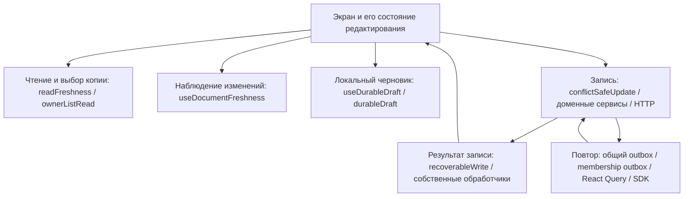

# Синхронизация данных — аудит CONTEXT

Дата: 2026-09-12. Рабочий снимок: `1aa2f34c`, worktree `2767/my-preacher-helper`.
Стадия: Mike CONTEXT, картина для сверки с владельцем. Решение об архитектуре и миграции ещё не принято.

## Запрос и границы

Владелец хочет инкапсулированный механизм чтения и записи для всех разделов. Сохранение офлайн, работа двух устройств, получение чужих изменений, восстановление после закрытия и поведение при конфликте должны иметь общие гарантии. Обход механизма должен обнаруживаться автоматически, ломать проверку и показывать агенту правильный путь. Исправление общего механизма должно улучшать всех его потребителей.

Проверены проповеди и вложенные редакторы, серии, изучения/заметки, группы, молитвы, порядки служений, советы, календарь, настройки и вспомогательные операции. Схема владельца трактуется как желаемое устройство системы, а не доказательство существования готового ядра.

Это аудит исходников и поведения в управляемых тестах. Приложение, сервер, схема данных и рабочие документы пользователя не изменялись. Новые записи в BUGS.md и этот отчёт — результаты диагностики. Боевая база, установленная версия приложения и физические устройства в этом аудите не проверялись.

## 1. Факты с источниками

### Главный результат

**Повторно используемые части и архитектурный детектор существуют. Единого обязательного модуля, который владеет всем жизненным циклом чтения/редактирования/записи/восстановления, сейчас нет.**

Часть ответственности вынесена в общие функции; другая остаётся у экранов, сервисов и повторителей очередей. Даже вызов `conflictSafeUpdate` не гарантирует одинаковую защиту: исходное содержимое может быть не передано, проверка версии может быть отключена, а отклонённый текст может быть удалён самим экраном.

Стрелки между этими частями сегодня часто соединяет конкретный экран. Именно там повторно решаются вопросы «от какой версии редактирую», «этот текст уже сохранён или только отправлен», «можно ли удалить черновик», «можно ли принять пришедший ответ».

### Уже существующие общие части

Все пути в таблицах указаны относительно корня репозитория. Номера строк относятся к исследованному снимку.

| Ответственность | Реализация | Фактическая граница |
|---|---|---|
| Защита записи от устаревшей основы | `frontend/app/services/conflictSafeUpdate.client.ts:374` | Транзакционная проверка исходного содержимого либо счётчика версии. `expectedBaseline` необязателен; `expectedRevision: null` без baseline отключает сравнение. |
| Осознанная запись без проверки конфликта | тот же файл, `revisionedUpdate:116`, `revisionedBatch:145` | Повышает версию; некоторые операции порядка намеренно используют правило «последнее расположение побеждает». Само повышение версии не защищает от перезаписи. |
| Отделение очереди от подтверждённого сохранения | `frontend/app/utils/recoverableWrite.ts:50,84,277` | Общие результаты и обработчики существуют. Использование и момент очистки состояния остаются на стороне вызывающего кода. |
| Черновик на диске и восстановление | `frontend/app/hooks/useDurableDraft.ts`, `frontend/app/utils/durableDraft.ts:79,135` | Ключи владельца/документа/части; удаление только совпавшего подтверждённого текста. Отказ локального хранилища не превращается в обязательный результат для вызывающего кода. |
| Намерение записи и повтор | `frontend/app/services/writeOutbox.client.ts:27,97`, `outboxReplay.client.ts` | Собственная очередь в localStorage. Поддерживает обычные patch и специальные операции проповеди. Это не единственная очередь приложения. |
| Выбор читаемой копии | `frontend/app/utils/readFreshness.ts:16,66,80` | Сравнивает версии частей документа и время. Не владеет отдельным набираемым черновиком. |
| Наблюдение чужих изменений | `frontend/app/hooks/useDocumentFreshness.ts` | Вычисляет актуальность, но сам не принимает документ в редактор. Корректность зависит от переданного подтверждённого состояния. |
| Ограниченное по времени чтение с резервным HTTP | `frontend/app/services/ownerListRead.client.ts:46`, `ownerHttpTransport.client.ts` | Общий механизм есть, но подключён не ко всем коллекциям/детальным чтениям. |
| Восстановление React Query после перезапуска | `frontend/app/utils/mutationDefaults.ts`, `providers/QueryProvider.tsx:27,122` | Второй набор функций записи. Он может отличаться от функций, используемых открытым экраном. |
| Связи серии и её элементов | `frontend/app/services/seriesMembership.client.ts` | Отдельный доменный протокол, очередь и транзакции между документами. |

### Проповедь: один документ, разные контракты

| Часть / реальный путь | Что уже работает через общие части | Отличие или пробел |
|---|---|---|
| Название, стих и основные поля | `sermons.client.ts:245`; редактор передаёт версию и исходные значения | Сервис сохраняет запасной путь без проверки, если версия не передана. Нельзя оценивать сервис отдельно от вызывающего экрана. |
| Шаги подготовки | `sermons.client.ts:327`; экран передаёт `changedKeys`, пишет вложенные поля, хранит черновик | Изменения разных шагов разделены; конкуренция внутри одного шага не использует тот же content-CAS, что редактор заметки. |
| Мысли: текст, теги, фиксация, размещение | `sermons.client.ts:976`; передаются исходная мысль и изменённые поля, онлайн применяется транзакция | Для пересекающегося поля действует собственная политика. Офлайн `atomicUpdate` может отправлять вычисленный ранее массив целиком. |
| Структура / распределение по разделам | `sermons.client.ts:410`, `mergeSections.ts` | Собственное слияние; офлайн сохраняется семантическое намерение. Это доменная надстройка, а не обычный patch. |
| План/outline: пункты, подпункты, заметки | `sermons.client.ts:555`, `mergeOutline.ts` | Есть слияние с исходным outline; несколько экранов явно выбирают `preferMine`. Без исходного outline остаётся полная запись. Политика пересечения неодинакова у редакторов. |
| Текст плана по узлам | `sermons.client.ts:1337`, `usePlanActions`, `useManualConspectus`, `usePlanTextDraft` | Основные редакторы передают baseline отдельных узлов, используют общий guarded write и свои черновики по ячейкам. Интерфейс всё ещё допускает вызов без контекста; отображение ожидающих записей между вкладками имеет отдельный незакрытый случай в BUGS.md. |
| Наброски / scratch | `sermons.client.ts:770–873`, `mergeScratch.ts:67` | **Воспроизведена потеря независимой правки существующей соседней карточки.** Добавления новых ID и некоторые удаления сливаются, но это не полноценное трёхстороннее слияние существующего текста. |
| Перенос наброска в outline | `sermons.client.ts:655` | Совместная атомарная операция и отдельный вид намерения в outbox. Такое доменное действие нельзя заменить двумя независимыми сохранениями. |
| Даты проповедования в календаре | `usePreachDates` → `preachDates.service.ts` → API → `sermons.repository.ts` | Активный серверный путь уже транзакционный. Это отличается от старой записи BUGS.md. Проверки исходного текста одной даты нет; ID операции внутри одного HTTP-запроса не доказывает идемпотентность повторного запроса. Старый клиентский RMW-путь не следует путать с активным календарём. |

**Вывод:** отдельные решения проповеди полезны как образцы, но вся проповедь не является доказанным эталоном, который достаточно механически подключить везде.

### Остальные разделы

| Раздел | Запись, офлайн и восстановление | Чтение / принятие чужой версии |
|---|---|---|
| Изучения / заметки | `studies.service.ts`, `studies/[id]/useNoteAutoSave.ts`: версия + исходное содержимое, общий результат, durable draft; `mutationDefaults.ts:477–489` сохраняет baseline при восстановлении | Редактор сопоставляет чужое состояние с **подтверждённым текстом редактора**, а не просто текущим query-cache. Это наиболее цельный из изученных примеров композиции. Список всё ещё читается прямым SDK. |
| Серии: основные поля | `series.service.ts`, `useSeriesDetail.ts`: защищённые изменения; в общем API есть вариант без версии | Свой цикл принятия результата и разрешения элементов серии; не единая с заметками сессия редактора. |
| Серии: состав и перенос | `seriesMembership.client.ts`: собственная очередь и междокументные транзакции | Отдельная доменная гарантия связи; при отказе хранения есть резервный путь, который требует отдельного анализа сохранности. |
| Группы: содержание, templates, flow | `groups.service.ts:110`, `useGroupDetail.ts`; версия и восстановление конфликта | В `groups/[id]/page.tsx:340–361` baseline **сознательно не передают** после прежних ложных конфликтов со своей записью. Комментарий прямо описывает нехватку общего управления подтверждённой основой. Деталь читается прямым SDK. |
| Группы: встречи / календарь | `groups.service.ts:223`: онлайн чтение массива и последующая полная запись; add/delete через atomicUpdate | **Два воспроизводимых сценария потери другой встречи:** онлайн между read/write и офлайн при добавлении. Календарные запросы не равны наблюдению каждого открытого документа. |
| Молитвы: текст и статус | `usePrayerRequests.ts:197,308`: версия + baseline; общие результаты и восстановление конфликтов | `usePrayerDetail` использует общую свежесть. При восстановлении через `mutationDefaults.ts:342–366` baseline не передаётся, хотя обычный вызов его передаёт; контракт после перезапуска отличается. |
| Молитвы: журнал ответов/обновлений | Собственное изменение вложенного массива через atomicUpdate | Онлайн транзакция и офлайн запись вычисленного массива дают разные гарантии. Это тот же класс риска, что массивы в других документах; отдельный живой сценарий здесь не воспроизводился. |
| Дела сердечные: порядки служений | Онлайн authenticated HTTP + CAS и отсутствие повтора неопределённой записи через другой транспорт; офлайн отдельный SDK/outbox путь | `care/orders/[id]/page.tsx:164`: общая свежесть с независимым чтением и опросом раз в 15 секунд. Есть собственные ограждения запросов и сессии редактора; исправления этого экрана не автоматически распространяются на остальные. |
| Дела сердечные: советы | Онлайн HTTP + версия; офлайн целый документ через SDK; свой debounce writer | **При конфликте отклонённый локальный текст заменяется серверным и снимается с очереди.** Нет общего наблюдателя свежести. Офлайн queued выдаётся до известного результата локальной постановки, отказ SDK только логируется. |
| Посещения | Отдельная карточка раздела в `care/page.tsx` пока «скоро»; визит как категория порядка служения идёт по механизму service orders | Нельзя заявлять отдельный проверенный журнал посещений, которого ещё нет в текущем UI. |
| Настройки, теги, шаблоны плана | Настройки — запись отдельных полей; теги — собственные CRUD; шаблоны — версия без content baseline | Есть общие части обработки записи, но это не тот же полный контракт редактирования. Наблюдение settings не означает наблюдение документов шаблонов. |
| Share links / study materials / старые API | Отдельные серверные интерфейсы; часть вспомогательных маршрутов не найдена в текущих вызовах экранов | Они вне клиентского detector. Наличие серверного маршрута учитывается как доступная поверхность, но не доказывает, что текущая кнопка использует его. |
| Аудиочерновики, таймеры, локальные предпочтения UI | Например, `useRecordingDrafts` хранит локальные аудиоблобы в IndexedDB | Это отдельный класс локальных ресурсов; в данном коде они не становятся облачными документами от подключения общего Firestore writer. |

Дополнительно: у `useGroups.updateExistingGroup` и `useSeries.updateExistingSeries` обнаружены интерфейсы без обязательной версии, но реальные текущие потребители этих конкретных функций поиском не найдены. Они не записаны как доказанный активный сценарий потери текста.

### Чтение тоже неодинаково

1. `readOwnerList` подключён к спискам проповедей, молитв, шаблонов плана, порядков служений, советов и календарным проповедям. Списки групп, серий и заметок продолжают использовать прямой `getDocs`. Комментарий «used by every owner list» шире фактического подключения.
2. У проповеди есть выбор между детальной и усечённой списковой копией; `useSermon` использует `selectReadableCopy`. `useGroupDetail` возвращает полученный документ без такого же общего согласования. Это различие реализации, а не доказательство любого конкретного сбоя группы.
3. `useDocumentFreshness` сообщает о новой версии; решение заменить содержимое редактора принимает вызывающий код. В заметках есть отдельная подтверждённая основа. Другие экраны могут строить `known` из меняющегося кэша. Этим объясняется, почему исправление одного хука не автоматически исправляет все ложные предупреждения.
4. Обновление при focus/reconnect запроса, ручная кнопка, SDK listener и независимый HTTP polling — разные механизмы. Календарь проповедей включает refetch при focus; общего обязательного документа-наблюдателя для всех календарных элементов нет.

### Офлайн — несколько независимых слоёв

| Слой | Где хранится / что делает | Чего не гарантирует сам по себе |
|---|---|---|
| PWA / Serwist | `sw.ts`: ресурсы приложения, специальные сетевые исключения; транспорт Firestore обходит service worker | Сохранность набираемого текста, разрешение конфликта, успешную сеть для AI |
| Firestore replica | `firebaseClientDb.ts:35`: IndexedDB и `persistentMultipleTabManager` | Безусловная запись не становится проверкой исходной версии |
| React Query persistence | `queryPersister.ts:113`, `QueryProvider.tsx:27`: IndexedDB; сохраняются paused/error mutations | Не является журналом всех ещё не завершившихся HTTP-запросов; pending non-paused не сохраняются |
| Общий outbox | `writeOutbox.client.ts:20,97`: localStorage; намерение с владельцем/основой, replay | Не владеет всеми legacy SDK writes и всеми доменными очередями |
| Membership outbox | Отдельное localStorage-хранилище связей серий | Не заменяет общий outbox или черновик редактора |
| Durable draft | `durableDraft.ts:79`: localStorage с обработкой переполнения | Возврат `void` не даёт обязательного доказательства успешного хранения |

`OutboxDrain.tsx` запускает повтор при монтировании, возвращении сети и каждые 60 секунд; видимый running guard локален экземпляру компонента, а не является общей межвкладочной блокировкой. Полная корректность конкурирующих повторителей в этом аудите не доказана.

Документация Firestore подтверждает: офлайн-реплика синхронизируется при возвращении сети, но для конкурирующих изменений действует last-write-wins; клиентские транзакции офлайн не выполняются. Поэтому собственной очереди намерений и явного контракта конфликта недостаточно заменить флагом persistence. Источники: [offline persistence](https://firebase.google.com/docs/firestore/manage-data/enable-offline), [transactions](https://firebase.google.com/docs/firestore/manage-data/transactions).

Восстановленная mutation требует default mutation function — это штатная особенность React Query, поэтому `mutationDefaults.ts` является реальным вторым путём выполнения, а не только конфигурацией. [TanStack Query: persisting offline mutations](https://tanstack.com/query/latest/docs/framework/react/guides/mutations#persisting-offline-mutations).

### Что делает детектор

Источник: `frontend/__tests__/architecture/writesGoThroughTheInterface.test.ts:1–155`.

- Память владельца подтвердилась: тест объясняет правильный вход и выдаёт подсказку использовать `conflictSafeUpdate` или осознанный `revisionedUpdate`.
- Сейчас он замораживает бюджет: **16 файлов, 44 текстовых совпадения**. Это не количество багов и не количество независимых операций: внутри есть разрешённое ядро, служебные записи и совпадения в комментариях.
- Считает `updateDoc`, `setDoc`, `writeBatch`, `runTransaction`, а также `.update/.set` у нескольких известных имён переменных.
- Не охватывает `app/api/**`, `addDoc`, `deleteDoc`, чтения, обход через alias/dynamic access, ошибки передачи baseline, удаление черновика до подтверждения, принятие устаревшего ответа и изменение политики между обычной записью и replay.
- Даже прямой путь совета офлайн разрешён явно. Значит зелёный guard означает «заданный текстовый бюджет не превышен», а не «каждая операция имеет гарантии владельца».

Дополнительная AST-инвентаризация именованных импортов Firestore сохранена в `.sessions/firestore-call-inventory.json`. Она охватила 684 runtime TypeScript-файла и нашла 155 вызовов импортированных функций, включая построение ссылок/запросов. Это синтаксический инвентарь для поиска, не полный семантический граф всех возможных записей.

### Воспроизводимые наблюдения

Стенд: локальный Node/Jest, зависимости существующего основного checkout подключены временной ссылкой; существующие тесты и реальные функции приложения с управляемыми границами Firestore/HTTP. Пользовательские документы не затрагивались.

| Проба | Ожидалось | Получено |
|---|---|---|
| Наброски: на устройстве A изменили карточку A, на B — существующую карточку B | `[A1, B1]` | `mergeScratch(base=[A0,B0], mine=[A1,B0], stored=[A0,B1])` возвращает `[A1,B0]` |
| Встречи группы онлайн: B обновилась после чтения, перед сохранением A | Обе независимые правки | Реальный сервис записывает вычисленный целый массив и возвращает B к B0 |
| Встречи группы офлайн: добавление C из старой локальной копии | C добавлена, B1 сохранена | В очередь попадает массив с B0; применение возвращает B к B0 |
| Совет: сервер отклонил локальный текст из-за чужой версии | Локальный текст остаётся доступным для решения | Реальный `useCouncils` ставит чужой текст в query-cache, очищает ожидающую запись |
| Совет офлайн: SDK отверг запись | Отказ становится доступным вызывающему коду/восстановлению | `saveCouncil` возвращает `queued`, отклонение уходит в console |

**Существующие проверки:** 29 suites / 425 tests прошли. **Дополнительные диагностические проверки желаемого контракта:** 5 из 5 получили ожидаемое падение на текущем коде. Это доказательства пяти сценариев, а не пять исправленных багов и не измеренная частота потери данных в production.

Исходники временных проб архивированы в `.sessions/syncDiagnostic.probe.test.tsx.source` и `.sessions/syncGroupsDiagnostic.probe.test.ts.source`; сырые результаты — `sync-diagnostic-tests.json`, `sync-domain-tests.json`, `sync-diagnostic-probes.json`, `sync-groups-probes.json`. Список команд для повторения находится в журнале этой сессии. Эти локальные свидетельства лежат в игнорируемой `.sessions`; суть каждого наблюдения сохранена выше и в BUGS.md.

Почему прежние тесты не остановили это: тесты `mergeScratch` не предъявляли случай независимых правок двух уже существующих карточек; страничный тест совета подменяет `useCouncils`, поэтому не проверяет реальный путь очистки при конфликте. Текстовый архитектурный guard такие последствия не исследует.

### Актуальность старых записей

В BUGS.md остались исторические утверждения, не совпадающие с текущими реализациями: отсутствие freshness/HTTP у service orders, отсутствие резервного чтения некоторых списков, старый RMW активного серверного календаря проповедей. Текущий код уже содержит соответствующие изменения. Эти записи не удалялись: локальная сверка не является повторной сертификацией опубликованной версии и устройств.

Ещё одно расхождение: описание общего outbox как IndexedDB в `frontend/docs/recoverable-writes.md` не соответствует реализации localStorage. При проектировании следует опираться на текущий код и проверяемый контракт, а не считать весь текст MEMORY/BUGS/docs актуальным автоматически.

## 2. Допущения для сверки

1. Под «единым механизмом» понимаем общие обязательные гарантии и входы для доменных операций. Не обязательно один физический файл или один транспорт: облачный документ, совместный перенос между документами и локальный аудиоблоб имеют разные требования.
2. Независимые правки должны сохраняться обе. При пересечении человеческого текста нужен способ сохранить варианты до решения; автоматический `preferMine` нельзя молча объявлять универсальной политикой. Сейчас он в нескольких местах выбран намеренно.
3. Существующие primitives — база для дальнейшего решения, а не материал для автоматического переписывания с нуля. Редактор заметки, текст плана по узлам и свежесть service orders дают полезные части образца, но ни один не доказан универсальным эталоном.
4. Целевой detector должен проверять и допустимые зависимости, и договорённости жизненного цикла; один запрет прямого SDK-вызова не покрывает ошибку внутри разрешённого модуля.

Это направления для следующего этапа, а не согласованный дизайн или разрешение миграции.

## 3. Неизвестное и пределы доказательств

- Не проверено поведение текущего production на физическом iOS/macOS/Android, в обычном браузере и установленной PWA: фон, выгрузка процесса, перезапуск, переполнение хранилища, обновление service worker, два устройства и две вкладки.
- В этом репозитории найдена общая веб/PWA-реализация; отдельные нативные iOS/Android/macOS клиенты поиском проектных файлов не обнаружены. Если платформы означают также отдельные приложения вне этого репозитория, их код ещё не обследован.
- Не установлена частота потерь у реальных пользователей; в production не проводились конкурентные записи. Управляемые тесты доказывают механизм конкретного отказа, а не его распространённость.
- Не доказана полная безопасность удаления, повторного создания, HTTP-ответа с неизвестным результатом и миграции очередей между версиями приложения. Эти операции учтены как отдельные обязательные контракты, но не все прогнаны end-to-end.
- Не доказана общая изоляция всех кэшей/очередей при смене аккаунта, корректность нескольких одновременных replay workers и сохранность при отказе localStorage/IndexedDB. Наличие owner keys в части модулей не заменяет такую проверку.
- Не выбран общий пользовательский порядок разрешения совпавших правок текста, удаления против редактирования и перестановок. Существующие политики различаются; менять их в ходе CONTEXT нельзя.
- Список API-поверхностей шире используемых UI-путей. Отсутствие найденного вызова означает «не найден в данном снимке», а не доказанную недоступность маршрута извне.

## Результат этапа

На вопрос «есть ли основа и детектор?» — **да**. На вопрос «достаточно ли просто подключить остальных к готовому идеальному модулю проповеди?» — **нет**: часть общего контракта пока живёт у потребителей, а в существующем слиянии набросков уже воспроизводится потеря текста.

Следующая сверка должна решить, какую единую гарантию получит операция от начала редактирования до подтверждения или восстановления, и какие доменные политики остаются внутри неё. Только после этого можно выбирать границы модуля, усиление detector и порядок миграции. В этом этапе они не реализовывались.
